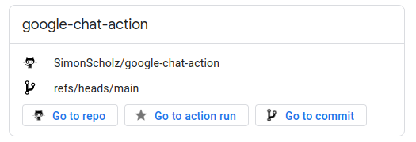
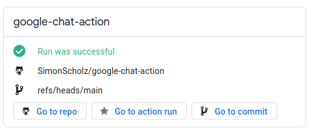
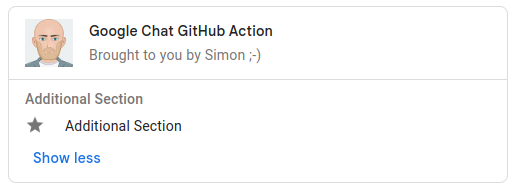

# google-chat-action

Github action to send Cards V2 to the google chat via webhook.

## Quick start



You'll get this bare minimum Google Chat card in case you only specify the required input, which is the `webhookUrl`.
In order to obtain this `webhookUrl` you need to click on the desired Google Chat, go to "Apps & Integrations" and then click on the "+ Add webhooks" button.


```yaml
name: Send Message to Google Chat

on:
  pull_request:
  push:
    branches:

  google-chat-action:
    name: Google Chat GitHub Action
    runs-on: ubuntu-latest

    steps:
      - name: Checkout
        id: checkout
        uses: actions/checkout@v4

      # ... Run your build stuff or whatever ...

      - name: Notify Google Chat
        if: ${{ always() }} # Use always to ensure that the notification is also send on failure of former steps
        uses: SimonScholz/google-chat-action@main
        with:
          webhookUrl: '${{ secrets.GOOGLE_CHAT_WEBHOOK_URL }}'
```

In case the action is triggered by a `pull_request` the last button in the button list will be "Go to pull request" instead of "Go to commit", which is shown on `push`.
If it is neither a `pull_request` nor a `push` trigger then only the "Go to repo" and "Go to action run" buttons will be shown.

## Also visualize the Status of the run

Usually notifications triggered by a github action are supposed to inform about the outcome of the action.

In order to see `success`, `failure` or `cancellation` the `${{ job.status }}` has to be passed to the action.



```yaml
name: Send Message to Google Chat

on:
  pull_request:
  push:
    branches:

  google-chat-action:
    name: Google Chat GitHub Action
    runs-on: ubuntu-latest

    steps:
      - name: Checkout
        id: checkout
        uses: actions/checkout@v4

      # ... Run your build stuff or whatever ...

      - name: Notify Google Chat
        if: ${{ always() }} # Use always to ensure that the notification is also send on failure of former steps
        uses: SimonScholz/google-chat-action@main
        with:
          webhookUrl: '${{ secrets.GOOGLE_CHAT_WEBHOOK_URL }}'
          jobStatus: '${{ job.status }}'
```

## Threading

It is possible to send multiple messages into the same thread, e.g. when new commits are pushed to an existing Pull Request using the
`threadKey` or `threadName` input.
Set `threadKey` to a stable value that uniquely identifies your thread when using the same user (i.e. webhookUrl) for multiple action runs.
`threadKey` must be set on the first message of the thread as well as all subsequent messages that should be added to the thread.
Every message sent to Google Chat generates a `threadName`, which can be retrieved by the `threadName` output of this action.
To reply to an existing thread you can therefore also pass the `threadName` output of one step to the `threadName` input of another.
This is especially useful when using mutliple users, since the threadKey is only unique per user, allowing you to reply to a thread
created by one action with one webhookUrl in another action using another webhookUrl.

For more information see the [Google Chat Message Thread API specification](https://developers.google.com/chat/api/reference/rest/v1/spaces.messages#Thread),
as well as [the Google Chat how-to on starting or replying to a thread](https://developers.google.com/chat/how-tos/webhooks#start_or_reply_to_a_message_thread).

## Example with most input values

`threadName` is unset, since it only makes sense to set one of `threadKey` or `threadName`.

```yaml
  - name: Notify Google Chat
    id: test-action
    if: failure() # only send notification in case of failure
    uses: SimonScholz/google-chat-action@main
    with:
        webhookUrl: '${{ secrets.GOOGLE_CHAT_WEBHOOK_URL }}'
        jobStatus: ${{ job.status }}
        title: Google Chat GitHub Action
        subtitle: Brought to you by Simon ;-)
        imageUrl: https://raw.githubusercontent.com/SimonScholz/simonscholz.github.io/gatsby-homepage/src/assets/img/avatar.webp
        imageType: SQUARE
        imageAltText: Alternative image text
        createDefaultSection: false
        collapsibleDefaultSection: false
        uncollapsibleWidgetsCount: 3
        additionalSections: '[{"header": "Additional Section", "collapsible": true, "widgets": [{"decoratedText": {"startIcon": {"knownIcon": "STAR"},"text": "Additional Section"}}] }]'
        threadKey: ${{ github.event.number }}
```

Due to setting `createDefaultSection` and `collapsibleDefaultSection` to false this card also looks pretty small:



With the `additionalSections` you also gain a lot freedom and also other actions could come up with something suitable like my [postman-newman-action](https://github.com/SimonScholz/postman-newman-action) does when setting its `outputGoogleCardV2` input property to true.

How an `additionalSections` array has to look like can be found here: https://developers.google.com/chat/api/reference/rest/v1/cards#section 

## Inputs

You can also refer to the [action.yml](https://github.com/SimonScholz/google-chat-action/blob/main/action.yml).

| Property      | Description                     |  Default  | Required   |
| ------------- | ------------------------------- | :-------: | :--------: |
| webhookUrl    | The webhook URL of the Google Chat. Should be stored in an action secret. | 🚫 |    ✅      |
| jobStatus     | The optional jobStatus. Values can be success, failure, cancelled. You should pass `${{ job.status }}` here. | 🚫  |    🚫      |
| title         | Optional title. If not set, it defaults to the action name | Action name |    🚫      |
| subtitle      | Optional subtitle. If not set, the subtitle will not be shown. | 🚫 (invisible) |   🚫      |
| imageUrl      | Optional icon. If not set, no icon will be shown. | 🚫 |    🚫      |
| imageType     | Optional imageType (imageUrl must be set for this). Possible values are SQUARE and CIRCLE. | CIRCLE |    🚫      |
| imageAltText  | Optional imageAltText. Alternative in case the image cannot be shown. | 🚫  |    🚫      |
| createDefaultSection | Optional createSection. Specify whether the default section should be shown or not. | true  |    🚫      |
| collapsibleDefaultSection | Optional collapsibleSection. Specify whether the section is collapsible.  | false |   🚫      |
| uncollapsibleWidgetsCount | Optional uncollapsibleWidgetsCount. Specify the amount of uncollapsible widgets within the sections. | 4 |   🚫      |
| additionalSections |  Add the opportunity to have additional sections. Also see [Google Chat Card V2](https://developers.google.com/chat/api/reference/rest/v1/cards#section) sections array. | 🚫 |    🚫      |
| threadKey |  Create or reply to a thread identified by this value. For replying to a thread this message must be sent by the same Google Chat user as the initial message. Also see [Google Chat Message Thread](https://developers.google.com/chat/api/reference/rest/v1/spaces.messages#Thread). | 🚫 |    🚫      |
| threadName |  Reply to a thread regardless of the user that initially created it. Also see [Google Chat Message Thread](https://developers.google.com/chat/api/reference/rest/v1/spaces.messages#Thread). Takes precedence over threadKey. | 🚫 |    🚫      |

## Outputs

| Output     | Description   |
| ---------- | --------------|
| threadName | Name of thread created by this message. Can be used as input "threadName" for subsequent calls to this action to have follow-up messages in a thread. |

## Contributing

If you have any questions or ideas feel free to open an issue or a pull request.

When creating a pull request please make sure that you have run `npm run all` before you commit/push, otherwise CI will fail.
